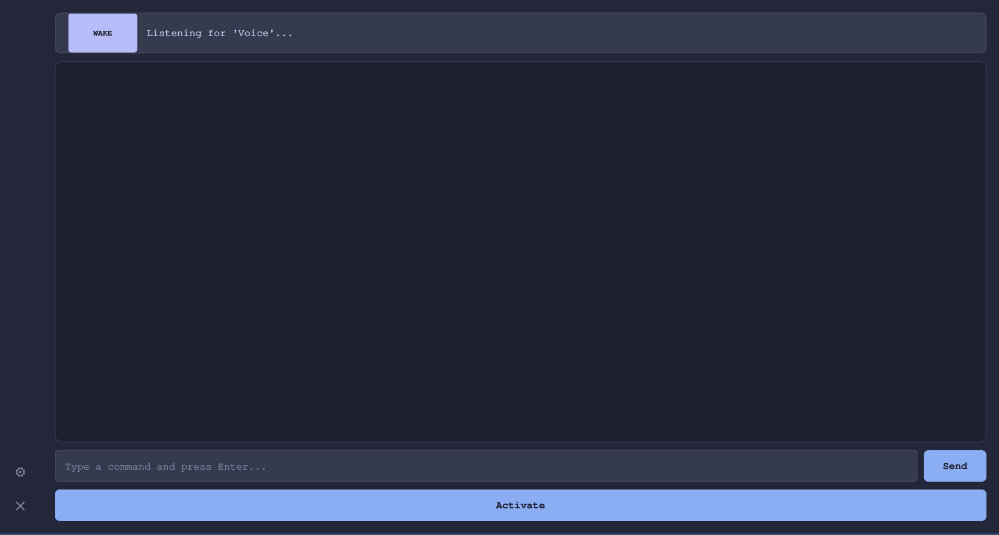
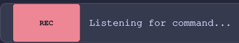
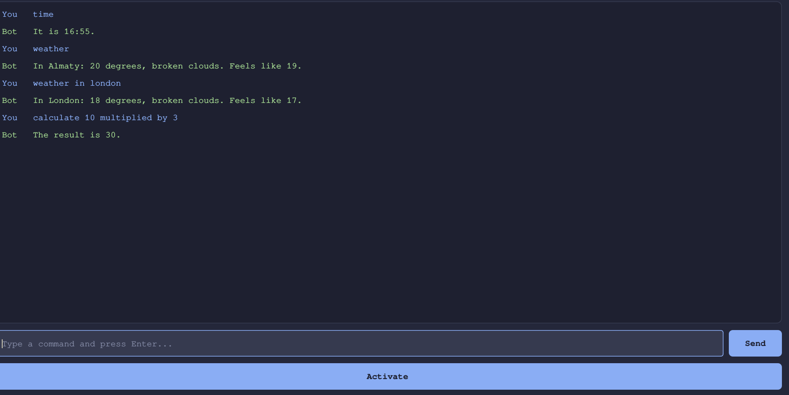
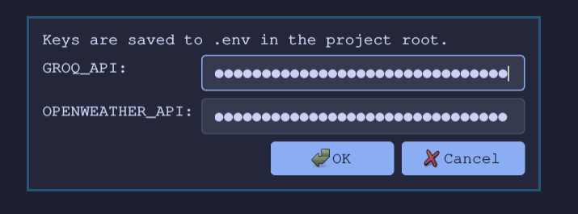

# GVoiceBot

## Description

GVoiceBot is a desktop voice assistant built with Python. It listens for a wake word, transcribes speech using the Groq Whisper API, processes the command through a modular skill system, and responds using Microsoft Neural text-to-speech. All interactions are displayed in a graphical interface and persisted to a local SQLite database. Text input is supported alongside voice.

---

## Technologies

| Component | Technology |
|---|---|
| Language | Python 3.10+ |
| GUI | PySide6 |
| Speech recognition | Groq API (Whisper large-v3) |
| Text-to-speech | edge-tts (Microsoft Neural TTS) |
| Audio I/O | sounddevice, miniaudio |
| Weather data | OpenWeatherMap API |
| Database | SQLite (built-in `sqlite3`) |

---

## Installation

**Requirements:** Python 3.10 or higher. On Linux, PortAudio must be installed:

```bash
sudo pacman -S portaudio        # Arch
sudo apt install libportaudio2  # Debian / Ubuntu
```

**Steps:**

```bash
git clone <repo-url>
cd gvoicebot
python -m venv .venv
source .venv/bin/activate
pip install -r requirements.txt
```

**API keys** — create a `.env` file in the project root:

```
GROQ_API=gsk_...
OPENWEATHER_API=...
```

Keys can also be entered through the Settings dialog inside the application.

---

## Project Structure

```
gvoicebot/
├── main.py               # Entry point; instantiates Assistant with all skills
├── assistant.py          # Assistant class — dispatches text to skills
├── stt.py                # Speech-to-text: microphone recording + Groq Whisper
├── tts.py                # Text-to-speech: edge-tts + miniaudio playback
├── db.py                 # SQLite: message storage and history queries
│
├── skills/
│   ├── base.py           # Abstract Skill base class
│   ├── greeting.py       # GreetingSkill
│   ├── time_skill.py     # TimeSkill, DateSkill
│   ├── weather.py        # WeatherSkill (OpenWeatherMap)
│   ├── calculator.py     # CalculatorSkill
│   ├── reminder.py       # ReminderSkill (threading.Timer)
│   └── history.py        # HistorySkill (SQLite history)
│
├── gui/
│   ├── app.py            # QApplication setup, stylesheet
│   ├── main_window.py    # MainWindow — root layout
│   ├── assistant_thread.py  # QThread wrapping the voice loop
│   ├── state.py          # AssistantState enum + badge metadata
│   ├── env_utils.py      # .env file load/save helpers
│   └── widgets/
│       ├── chat_widget.py      # Conversation log
│       ├── status_widget.py    # State badge
│       ├── sidebar.py          # Icon sidebar
│       └── settings_dialog.py  # API key editor
│
├── requirements.txt
└── README.md
```

---

## Module Descriptions

### main.py

Entry point. Creates an `Assistant` with all registered skills and exposes `process_query(text) -> tuple[str | None, str]` as the single public interface for both the voice thread and text input.

### assistant.py

`Assistant` iterates over its skill list and delegates to the first skill whose `can_handle()` returns `True`. Returns a `(voice, display)` tuple — `voice` is what gets spoken, `display` is what appears in the chat. If `voice` is `None`, the display text is spoken as well. If `voice` is an empty string, the response is silent.

### stt.py

Handles microphone capture and transcription.

| Constant | Value | Description |
|---|---|---|
| `WAKE_WORD` | `"voice"` | Trigger phrase |
| `WAKE_WORD_DURATION` | `3` s | Recording window for wake detection |
| `DURATION` | `5` s | Recording window for commands |
| `SILENCE_THRESHOLD` | `2000` | RMS below this is treated as silence |

`listen_for_wake_word()` records `WAKE_WORD_DURATION` seconds, transcribes via Groq Whisper, and checks for the wake word. Returns `(True, inline_command)` if detected — `inline_command` is non-empty when the user says `"Voice, <command>"` in a single utterance.

`listen()` records `DURATION` seconds and returns transcribed text.

### tts.py

`speak(text)` synthesizes and plays audio synchronously:
1. Calls `edge_tts.Communicate(text, VOICE).save()` — voice `en-US-JennyNeural`
2. Decodes the MP3 with `miniaudio.decode_file()`
3. Plays PCM samples via `sounddevice.play(..., blocking=True)`

No API key required.

### db.py

SQLite database stored in `history.db` next to the project. The table is created automatically on first run.

| Function | Description |
|---|---|
| `save_message(role, text)` | Insert a message |
| `get_history(limit)` | Last N messages, oldest first |
| `get_today_history()` | All messages from today |
| `clear_history()` | Delete all records |

### skills/

#### Base class — skills/base.py

```python
class Skill(ABC):
    keywords: list[str] = []

    def can_handle(self, text: str) -> bool:
        return any(re.search(rf"\b{re.escape(kw)}\b", text.lower()) for kw in self.keywords)

    @abstractmethod
    def execute(self, text: str) -> str: ...
```

Word-boundary matching (`\b`) prevents partial matches such as `"hi"` firing inside `"history"`.

To add a new skill: create a file in `skills/`, subclass `Skill`, set `keywords`, implement `execute()`, and add one line to `main.py`.

#### GreetingSkill

**Triggers:** `hello`, `hi`, `good morning`, `good evening`, `hey`, `greetings`

#### TimeSkill / DateSkill

**TimeSkill triggers:** `time`, `what time`, `current time`, `clock`
Returns current wall-clock time: *"It is 14:35."*

**DateSkill triggers:** `date`, `what day`, `today`, `what is today`
Returns current date using `strftime('%A, %B %-d, %Y')` — always in English regardless of system locale.

#### WeatherSkill

**Triggers:** `weather`, `temperature`, `outside`

Extracts a city name from phrases like *"weather in London"* using a regex. Falls back to `Almaty` if no city is found. Queries the OpenWeatherMap Current Weather API. Requires `OPENWEATHER_API`.

#### CalculatorSkill

**Triggers:** `calculate`, `compute`, `how much is`, `what is`, `equals`

Converts spoken operators to symbols before evaluation:

| Phrase | Operator |
|---|---|
| plus | `+` |
| minus | `-` |
| times | `*` |
| multiplied by | `*` |
| divided by | `/` |
| over | `/` |

#### ReminderSkill

**Triggers:** `remind me`, `set a reminder`, `reminder in`

Parses duration from phrases like *"remind me in 5 minutes to check the oven"*. Schedules a `threading.Timer` that calls `tts.speak()` when time elapses. Supported units: seconds, minutes, hours.

#### HistorySkill

**Triggers:** `show history`, `chat history`, `our conversation`, `history today`, `clear history`

| Command | Behavior |
|---|---|
| `show history` | Displays last 20 messages in chat |
| `history today` | Displays today's messages in chat |
| `clear history` | Deletes all records from the database |

Speaks *"Here is the history"* and shows the full list only in the chat window.

---

## Usage

```bash
python main.py
```

**Voice input:**

| Action | How |
|---|---|
| Wake word | Say **"Voice"** — the assistant replies "Yes?" — then say the command |
| Inline command | Say **"Voice, what time is it"** — the assistant answers immediately |
| Manual activation | Click the **Activate** button |

**Text input:** type any command in the input field and press **Enter** or **Send**.

---

## Examples

```
Voice, hello
→ Hello! I am your voice assistant. How can I help you?

Voice, what time is it
→ It is 14:35.

Voice, what is today
→ Today is Tuesday, May 19, 2026.

Voice, weather in London
→ In London: 16 degrees, broken clouds. Feels like 15.

Voice, what is 15 times 8
→ The result is 120.

Voice, remind me in 10 minutes to take a break
→ Got it, I will remind you in 10 minutes.

show history
→ [displays last 20 messages in the chat]

history today
→ [displays today's conversation in the chat]

clear history
→ History cleared.
```

---

## Screenshots

**Main window**



**Voice activation — WAKE state**


**Recording — REC state**



**Conversation example**



**Settings dialog**


